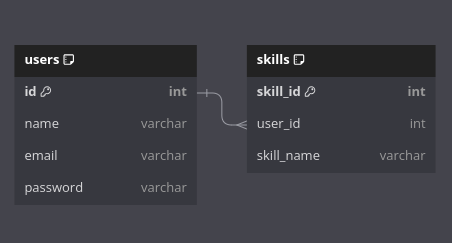
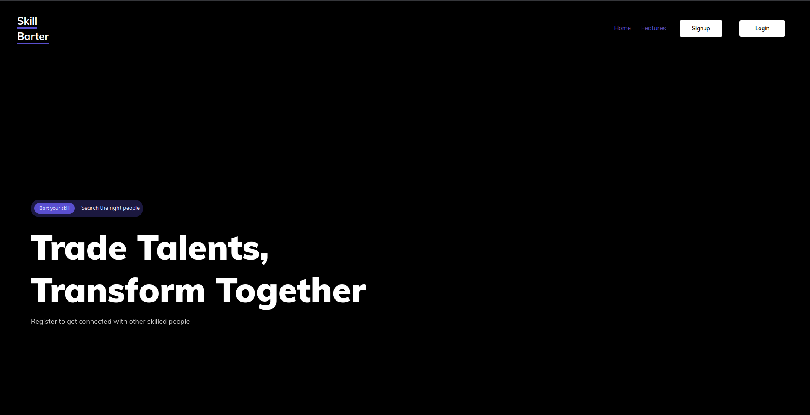
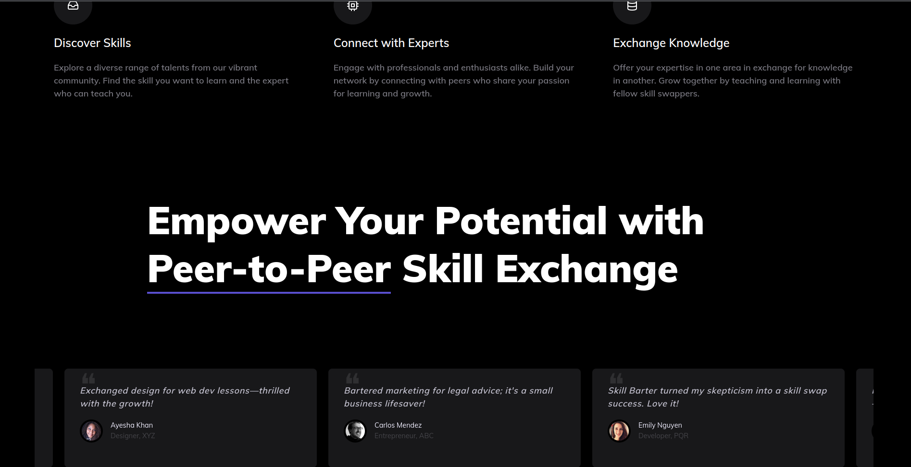
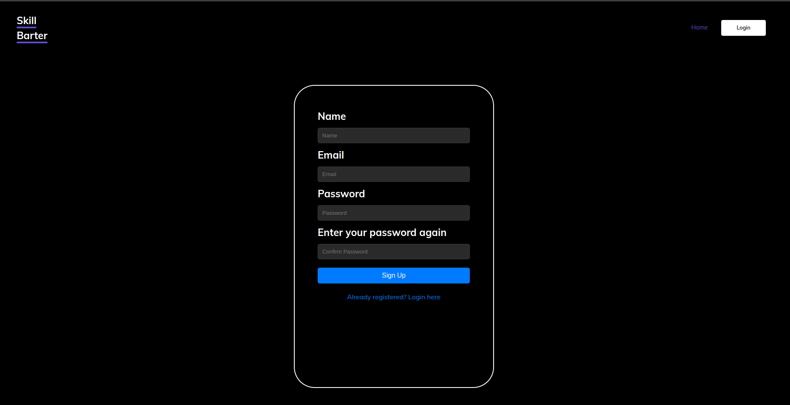
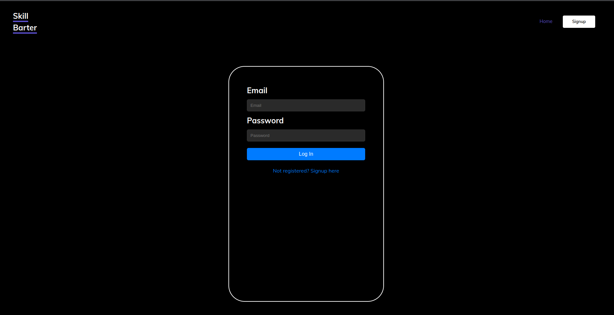
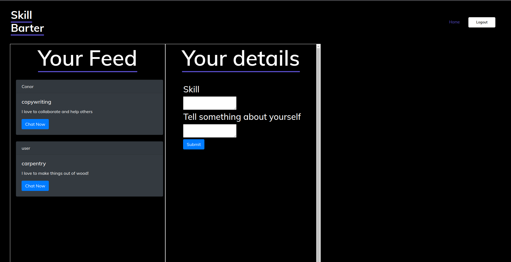
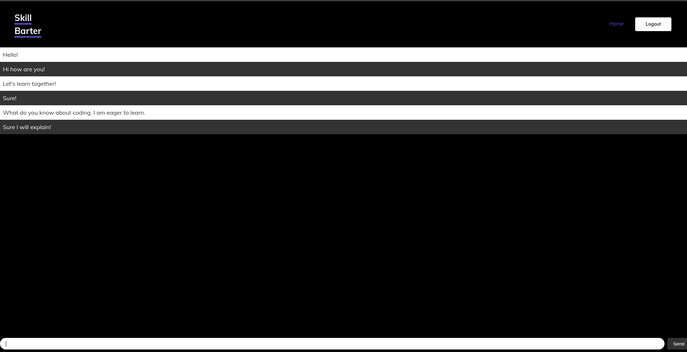

# Skill Barter Website

The skill barter website is a very simple webapp to connect one user to another user
who would agree to exchange skills with each other.

### Key features:

**User Authentication**: Secure login and sign-up functionalities. \
**Session Management**: Complete provision of sessions for login and logout. \
**Real time chat application**: Connect with other people and chat.

### Target Users:

* Anyone who wants to teach a skill in exchange for another skill.
## Tech Stack:

**Backend**: Node.js \
**Frontend**: HTML, CSS (Bootstrap), JavaScript \
**Database**: Postgresql \
**Other Libraries**: bcrypt, Express.js
**Real time communication**: Socket.io

# Installation

### Prerequisites
* Latest version of Node.js installed.

### 1. Clone Repo

```commandline
git clone https://github.com/shubh220922/Skill--barter-website.git
```
Go to the root of the directory.

### 2. Install dependencies

* Run ``npm install`` in the same directory containing ``package.json`` file.

```commandline
npm install
```

Note: create a `.env` file with the `DB_STRING` to connect to your own database

### 4. Run Application

```commandline
npm run start
```

This will run the website through nodemon.

### To run the application using Docker

```yaml

```

In the same directory run the following command and the website will run through docker:
```commandline
sudo docker compose up
```

# Database Schema


# Screenshots

### 1. Home Page



### 2. Sign Up and Sign In pages
Sign Up:

Sign In:


### 3. Dashboard page


### 4. Chat feature

